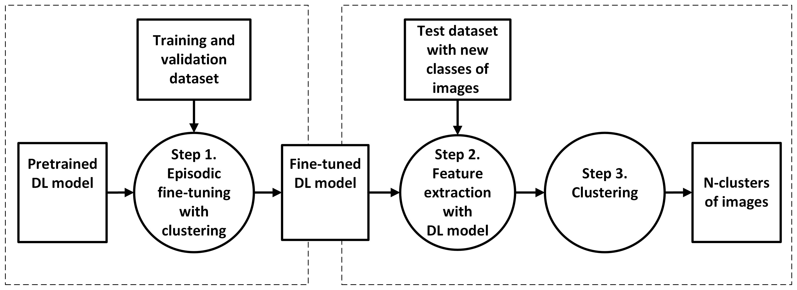

# Few-shot-clustering

This code base contains the python code for clustering of images using few-shot learning and episodic training.

The method is described in the paper:

K. Bjerge, P. Bodesheim, H. Karstoft, “Deep Image Clustering with Model-Agnostic Meta-Learning,” Accepted by the International Conference on Computer Vision and Theory and Applications (VISAPP 2025).

The paper link will be public in spring 2025.

Supplementary material with detailed results are found in:  
This document presents tables detailing the results of training deep learning models, including ResNet50v2, EfficientNetB3, ConvNeXt-B, and ViT-B/16, on various datasets such as EU Moths, Caltech Birds (CUB), tiered-ImageNet, and mini-ImageNet, as outlined in the accompanying paper.

# Installation conda environment on Windows

- conda create --name fslclust --file req_env_win.txt
- conda activate fslclust

The easy-few-shot-learning (easyfsl) framework has been used to boost our experiments with few-shot image classification. 
The framework contains libraries for 11 few-shot learning methods, handling of support and query data and Python code for resnet12 backend with episodic training.

Install the Python library easyfsl "pip install easyfsl" or use the GitHub:

https://github.com/sicara/easy-few-shot-learning

# Clustering of feature embeddings

python UnsupervisedGMM.py 

The code selectes one of the below datasets and computes the embedding features using a few-shot trained model with episodic training.
The resulting embeddings are clustered by selecting different clustering models such as GMM and K-means.

# Datasets used for training, validation, and testing
A copy of the prepared CU-Birds and EU-moths datasets can be downloaded from here:

https://drive.google.com/drive/folders/1xaAJG_-wGpqR0JRUAEjzbcZyS5GxrhNk

The miniImagenet and tieredImagenet dataset can be found here:

https://lyy.mpi-inf.mpg.de/mtl/download/Lmzjm9tX.html

The zipped files must be copied and unzipped to the folders:

 - data/CUB
 - data/euMoths
 - data/mini_imagenet
 - data/tiered_imagenet

## miniImageNet
This dataset presents a preprocessed version of the miniImageNet benchmark dataset used in few-shot learning. This version of miniImageNet is not resized to any particular size and is left to be the same size as they are in the ImageNet dataset.

Download and unzip the preprocessed version of the miniImageNet benchmark dataset from: https://www.kaggle.com/datasets/arjunashok33/miniimagenet

Copy the image files to data/mini_imagenet

The train.json, val.json, and test.json split the dataset into 60 classes for training, 20 validation classes, and 20 test classes.

With prepare/prepare_mini_imagenet.py it is possible to create another split of the miniImageNet dataset.

## tieredImageNet
The tieredImageNet is a subset of the larger ILSVRC-12 dataset used for few-shot-learning. 

The train.json, val.json, and test.json split the dataset into 351 classes for training, 97 validation classes, and 160 test classes.

## CU-Birds (CUB)
The Caltech-UCSD Birds-200-2011 (CUB-200-2011) dataset is a widely-used dataset for fine-grained visual categorization task. It contains 11,788 images of 200 subcategories belonging to birds.

Alternatively to use the files on drive.google download and extract the dataset from a Github which provides a make download-cub recipe to download and extract the dataset. See https://github.com/sicara/easy-few-shot-learning

The train.json, val.json, and test.json split the dataset into 140 train classes, 30 validation classes, and 30 test classes.

## EU-moths
This dataset presents a dataset of only 11 samples for each class of 200 classes of moth species.

Alternatively to use the files on drive.google download and unzip the Cropped images of the EU Moths dataset from: https://inf-cv.uni-jena.de/home/research/datasets/eu_moths_dataset/

Copy the image files to data/euMoths/images

The train.json, val.json, and test.json split the dataset into 100 train classes, 50 validation classes, and 50 test classes.

With prepare/prepare_eu_moths.py it is possible to create another split of the EU moths dataset.

# Episodic training
Episodic training for domain generalization is the problem of learning models that generalize to novel testing domains with different statistics and classes than in the set of the known training domain. The method learns a model that generalizes well to a novel domain without any knowledge of the novel validation domain with new classes during episodic model training. It is also called the meta-learning paradigm, here we have a set of tasks to learn in each epoch. Each task also called an episode contains a support set of K-classes (K-way) with a N-shot of images for each class. A query set of images is matched with the support set using a few-shot Protypical network that compares the embeddings from the backbone of the convolutional neural network. The Prototypical network uses the Euclidian distance as a similarity function during training to find the best matching class in the support set. Episodic training can be performed with and without pre-trained weights where the backbone in our experiments is ResNet50, EfficientNetB3, ConvNeXt-Base and ViT-B/16.

When training with pre-trained weights the model with the best Cluster Accuracy (CA) with K-means clustering on the validation dataset is stored.
The models and results will be stored in the folder modelsAdv and tensorboard log files are stored in the folder runs.

To view the tensorboard log files write: tensorflow --logdir runs/

# Episodic training with transfer learning
To train models on the dataset: "mini_imagenet", "tiered_imagenet", "CUB" and "euMoths" with pretrained weights from ImageNet the backbones ResNet50, EfficientNetB3, ConvNeXt-Base and ViT-B/16 is provided. 

The Linux bash script/trainResNet50_multi_alpha.sh contains command arguments to train with the ResNet50 models:

    python ClusterTraining.py --model resnet50 --dataset $1 --mode episodic --alpha 0.2 --m1 3 --m2 6 --epochs 8 --learnRate 0.001 --pretrained True --slossFunc Multi --cluster True --tasks 300 --valTasks 100 --way 30 --shot 5 --query 6 --device cuda:0

The linux bash script/trainEffNet_multi_alpha.sh contains command arguments to train with the EfficientNetB3 models:

    python ClusterTraining.py --model effB3 --dataset $1 --mode episodic --alpha 0.2 --m1 3 --m2 6 --epochs 8 --learnRate 0.001 --pretrained True --slossFunc Multi --cluster True --tasks 300 --valTasks 100 --way 25 --shot 5 --query 6 --device cuda:0
    
The linux bash script/trainConvNeXt_multi_alpha.sh contains command arguments to train with the ConvNeXt-Base models:

    python ClusterTraining.py --model ConvNeXt --dataset $1 --mode episodic --alpha 0.2 --m1 3 --m2 6 --epochs 8 --learnRate 0.001 --pretrained True --slossFunc Multi --cluster True --tasks 300 --valTasks 100 --way 15 --shot 5 --query 6 --device cuda:0

The linux bash script/trainViTB16_multi_alpha.sh contains command arguments to train with the ViT-B/16 models:

    python ClusterTraining.py --model ViTB16 --dataset $1 --mode episodic --alpha 0.2 --m1 3 --m2 6 --epochs 8 --learnRate 0.001 --pretrained True --slossFunc Multi --cluster True --tasks 300 --valTasks 100 --way 25 --shot 5 --query 6 --device cuda:0

The folder modelsAdv contains the trained models with files that are generated for every model and contains arguments and results for training.

# Deep Image Clustering with trained models

FewShotClustering.py - performs clustering on the test or validation dataset based on the trained models found in modelDir 
    
    python FewShotClustering.py --device cuda:0 --seed 0 --modelDir modelsAdv

plotFewShotClustering.py - printing and plotting results presented in paper

